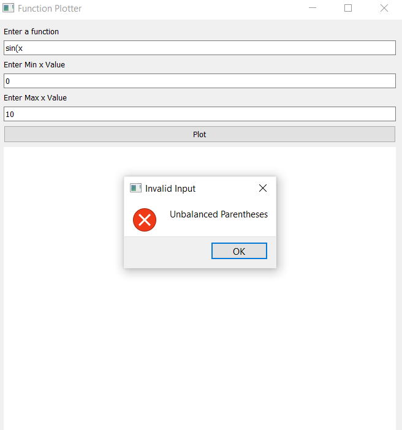

# Function Plotter

## Overview
Function Plotter is a GUI application that allows users to plot mathematical functions. The application provides an interface for entering a function as well as the range of x values and generating the corresponding plot. The application was built using Python, PySide2 for the GUI, and Matplotlib for plotting. 

## Features
- **User Interface**: The application provides a GUI where user can enter mathematical functions, set min and max values of x from the user.
- **Function Evaluation**: The application evaluates the user-entered function and generates a corresponding plot using the Matplotlib library.
- **Validation**: The application validates the user input to ensure its correctness.
- **Error Handling**: Function Plotter displays meaningful error messages when the user input is invalid.

Function Plotter GUI:


Function Plotter Error messages:



## Components
The application uses a model-view-controller (MVC) architecture that has the following components: 

#### FunctionPlotterModel
The **`FunctionPlotterModel`** class represents the data model of the application that stores the app state represented in the function expression and min and max values of x. The model provides getter and setter methods for accessing and modifying these values.

#### FunctionPlotterView
The **`FunctionPlotterView`** class handles the graphical user interface of the application. It sets up the main window, creates the necessary UI components (labels, text inputs, buttons, etc.), and provides methods to display error messages and plots.

#### FunctionPlotterController
The **`FunctionPlotterController`** class handles the application logic, user input, and communication between the model and view. The controller is responsible for coordinating the actions performed by the user with the model and updating the view accordingly.

## Usage
To run Function Plotter application, use the following command:
```
python function_plotter_main.py
```

## Testing 
The project includes automated tests using Pytest and Pytest-qt. 
These test cases cover various scenarios, including valid input, invalid input, edge cases, and specific functions like trigonometric, logarithmic, exponential, and constant functions. The tests ensure that the application behaves correctly and produces the expected results in different scenarios. 
To run automated tests, execute the following command:
```
pytest test_function_plotter.py
```
The tests will be executed, and the results will be displayed in the console.

